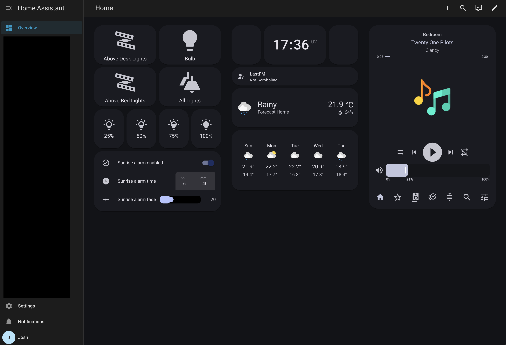

**Home automation is cool! Big tech however, isn't.**
That's where home assistant comes into play!

Before home assistant I used to use Google Home, but I've switched because
- Google does funky stuff with our data
- Not everything is supported
- I don't want to be locked in to one platform
- The app is bad

## But what exactly is home assistant?
Home assistant is an open source home automation platform, a bit like Google Home, except you actually own your data, it runs locally and you can make it do (almost) anything! There are no subscriptions, no upgrading your hub for one feature and no sending data to a server in the USA to turn your lights on and off. It's self hosted, and I run it on a Pi 4 sitting by my wifi router.

This here is my very own home assistant dashboard!
This lets me:
- Turn on/off my lights and change brightness
- Check the weather in my area
- Customise my sunrise alarm 
  - (A sunrise alarm slowly brightens lights until the set time)
- Control my Sonos Speaker

### Some other things I run on home assistant
- A tailscale exit node
  - Self hosted VPN. School censorship doesn't affect me as it routes traffic through my home network.
- Music Assistant
  - Powerful platform for local music streaming
- ESPhome
  - Turn ESP32s into smart home sensors!

If you've got a spare Pi lying around and an afternoon (or few), give Home Assistant a go! The official docs are solid, the community is huge, and worst case this time next month you will have spent hundreds of dollars on sensors, buttons, and other smart home devices.

See ya next time,

Josh

josh [at] slitro [dot] studio
